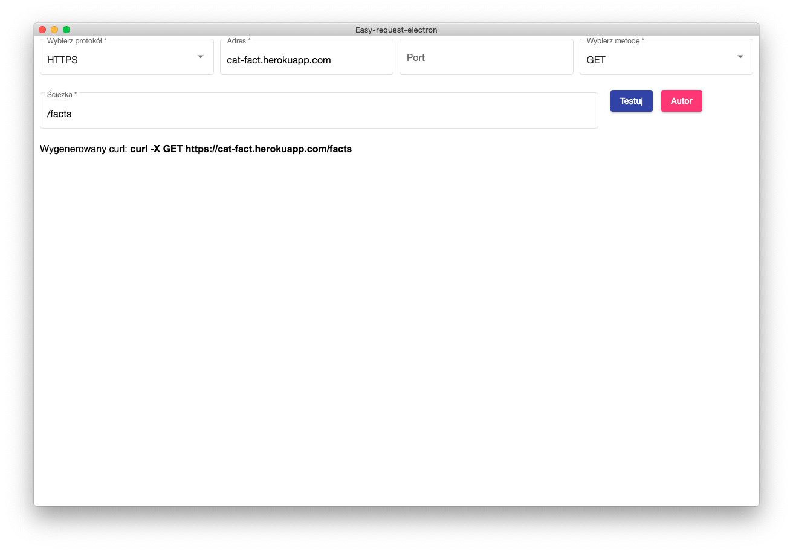
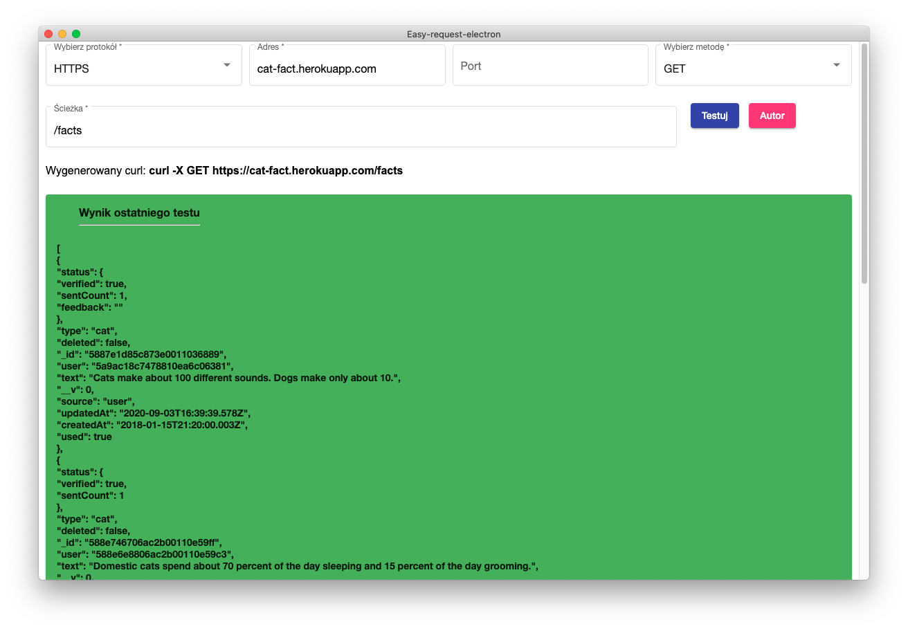
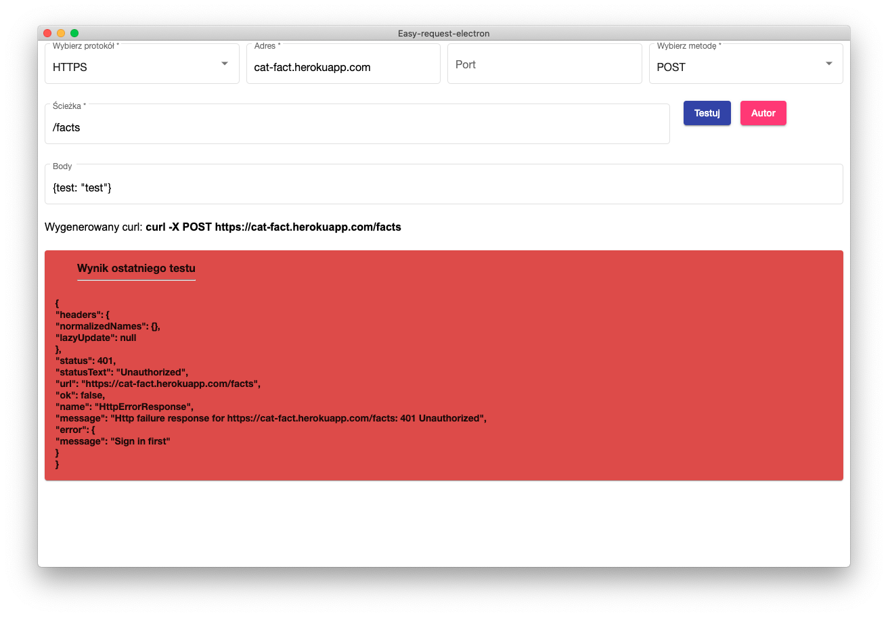
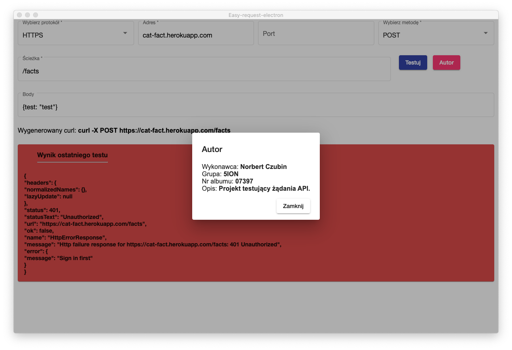

#Easy-request-electron
This app allows you to test any API after input endpoint.  
Whole application was made for completion of the semester on study.  

#Table of Contents

- [Editing app](#Editing app)
- [Building app](#Building app)
- [Functionality](#Functionality)
  - [Generating CURL command](#Generating CURL command)
  - [Direct testing from app](#Direct testing from app)
  - [Author info](#Author info)

#Editing app
If u wanna edit some code of this app, just edit `src` dir.  
Whole application just working on Angular, so you have to know basic of Angular.

#Building app
Look at all runnable scripts in `package.json`. There is all what u need.  
For production build of executable app just use in terminal (inside `package.json` dir):  
`$: npm run electron:build`  
If you want build production executable app for ex. MacOS, you have to build this app in this system!

#Functionality
Under this section, you can find functionality with short description.

###Generating CURL command
CURL is generated after you input the required info about endpoint.  
Let's use `cat-fact.herokuapp.com` for simply tests of generated CURL.  
We want to generate curl for GET method for som facts about cats.  

###Direct testing from app
We can also test this HTTP request via blue button `Testuj`.  
After successful request, app will show results.  

You can also use different method like POST, DELETE or PUT.  
Let's use for example POST for the same endpoint, but our `body` will be `{test: "test"}`.  

Here we have error, because as we can see from result, we are not authorized to send any `POST` for this endpoint.

###Author info
Click the pink button `Autor` for see same info about him.

#Thanks
So much thanks to:  
- [maximegris/angular-electron](https://github.com/maximegris/angular-electron) for really nice automation project.
- [alexwoglbruck/cat-facts](https://github.com/alexwohlbruck/cat-facts) for deployed API for testing.

##Author
Norbert Czubin  
Email: norbertcz23@gmail.com
